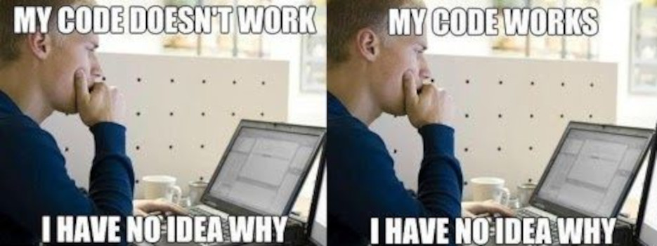
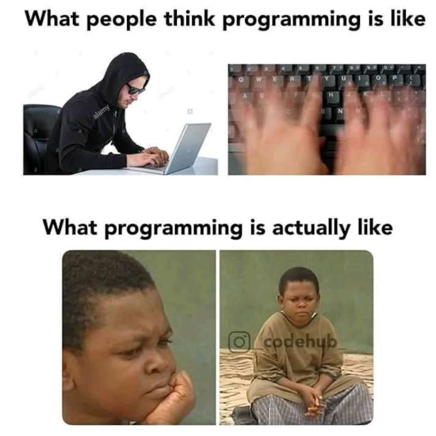

First Year
==========

### First Year: 1st Sem. - 3rd Subterm

* SE 1121 - Software Development I
  - you'd probably feel on December if SE is for you

### Coding is thinking

### Did you attend FOO 2020?

### Remember the shifting policy

- You can't shift to other engineering courses here in CPU if you fail
- You can't shift to other engineering courses with **POOR** grades (2.0 GPA req't)
- Options:
  * stay trapped sa Bahay ni COOya
  * transfer to another college if you wanna remain a  
    blue-and-
    gold-blooded mammal
  * transfer to other school if you wanna pursue other Engineering degrees

### First Year: 2nd Sem

- Continue foundational courses
- Highlight: SE-1221 (Introduction to Eng'g Design)
  

Sample IED Projects from this year (1/4)

<video src="media/recycler.mp4"></video>

Sample IED Projects from this year (2/4)

<video src="media/tiap.mp4"></video>

Sample IED Projects from this year (3/4)

<video src="media/foodify-demo-video.mp4"></video>

Sample IED Projects from this year (4/4)

<video src="media/FarmHub.mp4"></video>

### Take your studies seriously

* Historically, more than half of the SE population usually disappear after Year 1 😢
  - Will your batch break this c<del>o</del>urse
