Second Year
===========

### Second Year

- 5 to 6 SE courses per sem
- preparatory for the main events in 3rd and 4th years
- By the end of Year 2, you can:
  * build Web and mobile apps - **properly**
  * learn to solve computationally-expensive || hard problems
  * some hardware-series courses in 2nd sem
  * learn SE tools, industry best practices, and processes
    + SE Tools and Practices
    + Software Architecture
    + Software Testing
    + Software Engineering Proceses

### Algorithms Game Project (1/10)

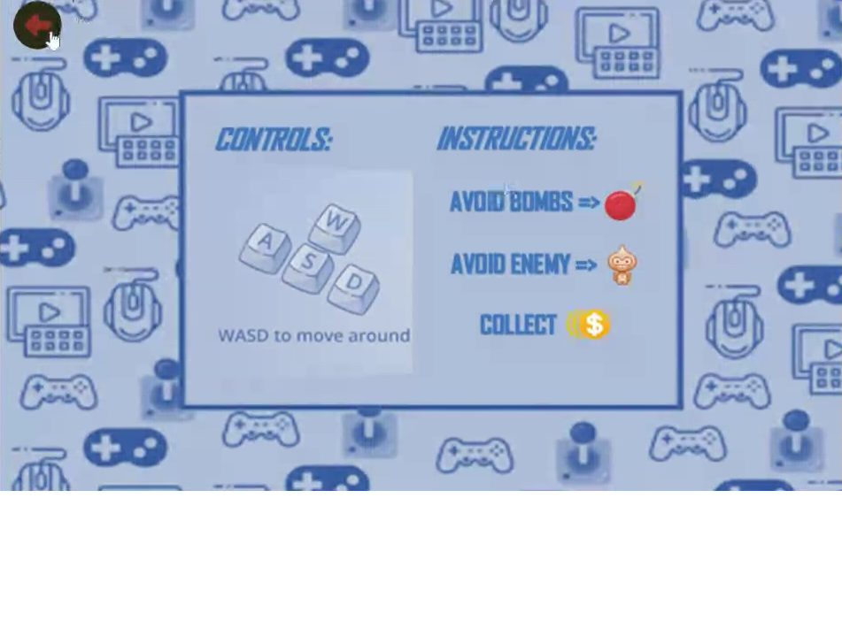

### Algorithms Game Project (2/10)

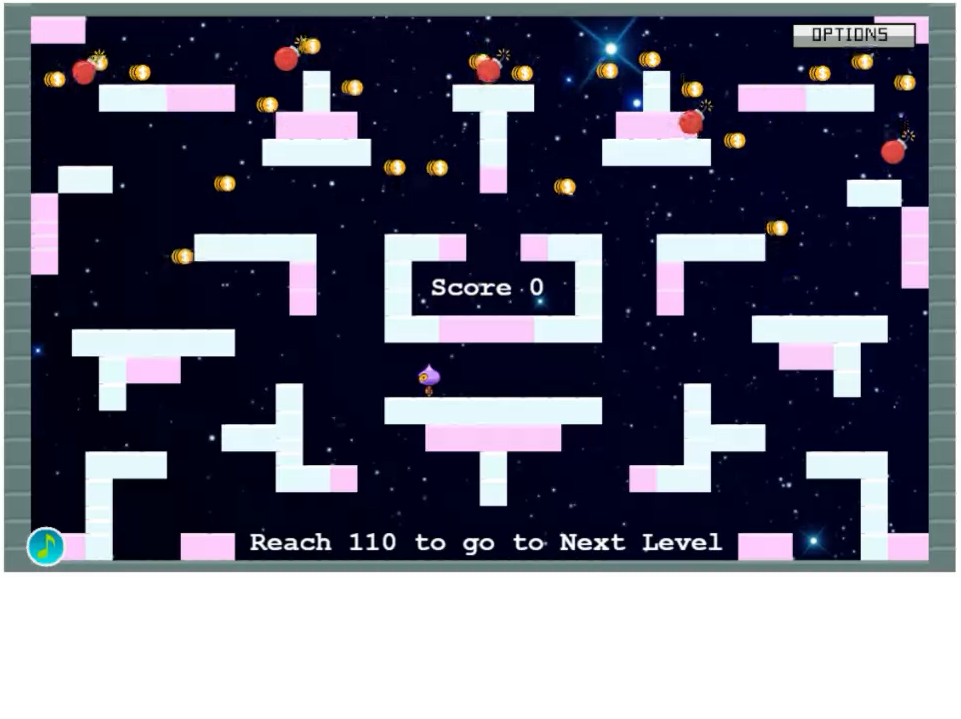

### Algorithms Game Project (3/10)

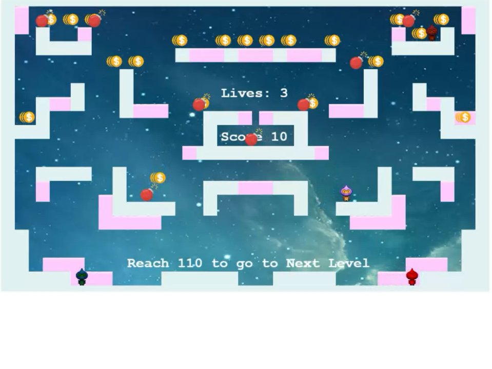

### Algorithms Game Project (4/10)

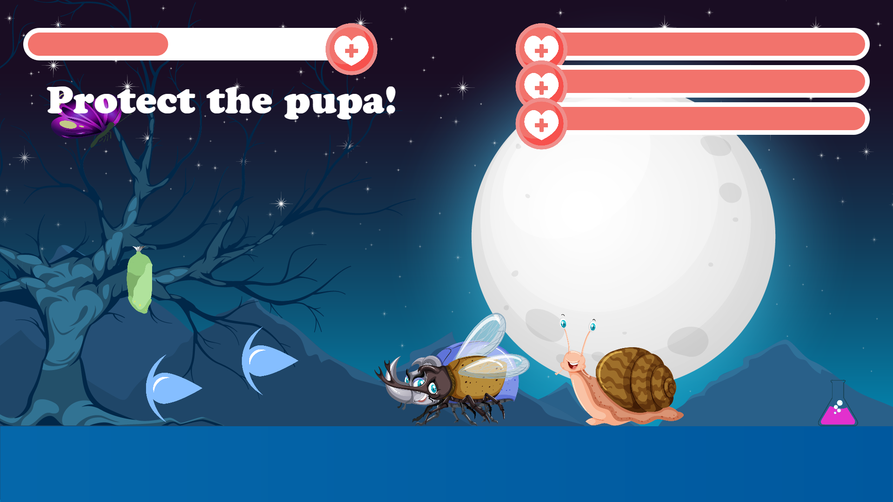

### Algorithms Game Project (5/10)

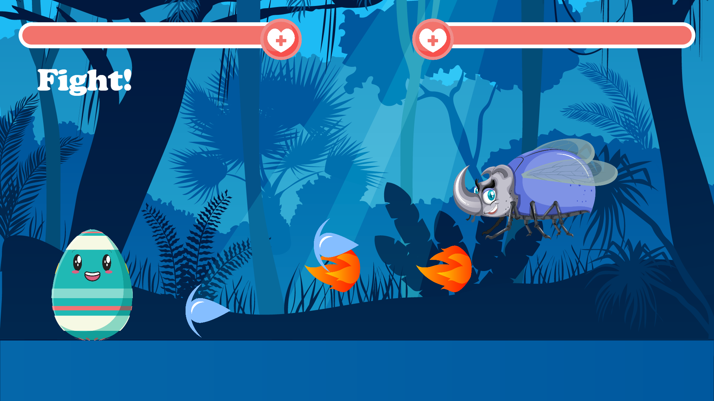

### Algorithms Game Project (6/10)

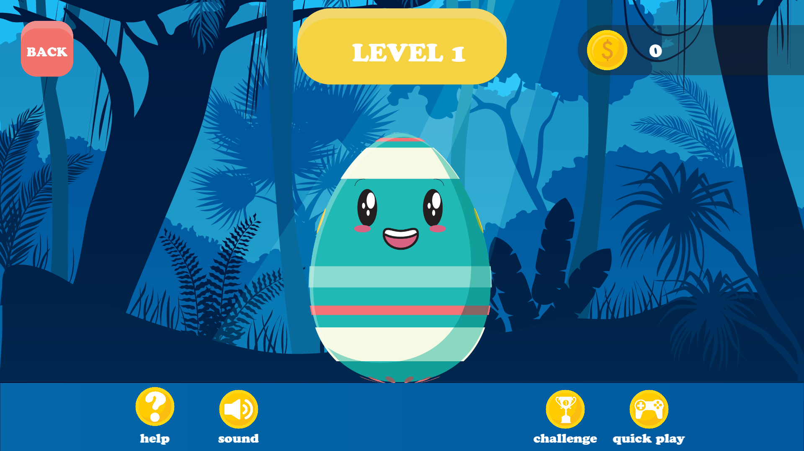

### Algorithms Game Project (7/10)

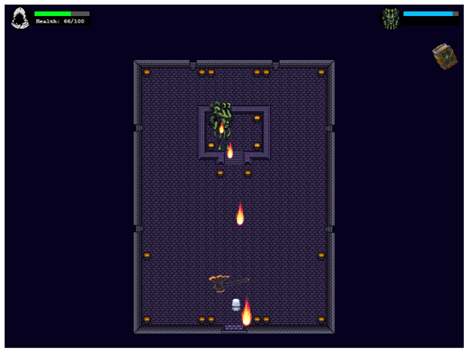

### Algorithms Game Project (8/10)

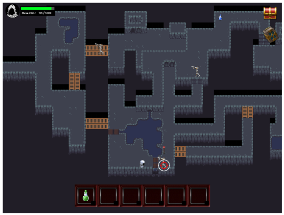

### Algorithms Game Project (9/10)

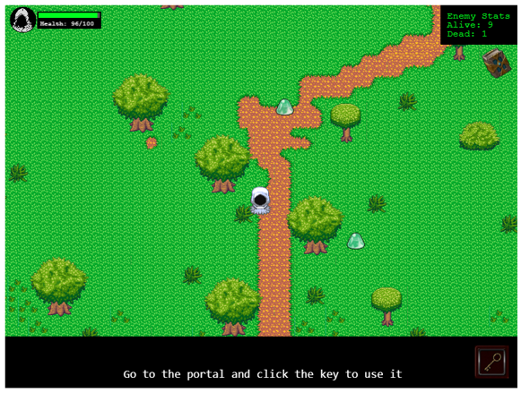

### Algorithms Game Project (10/10)

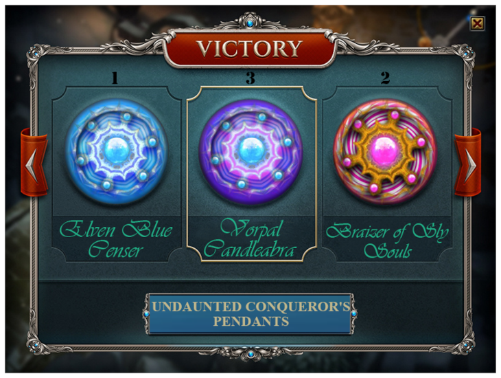

### In SE, we don't play

  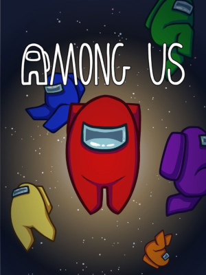
  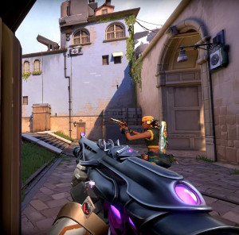
  

    
    
  

### In SE, we make

  
  
  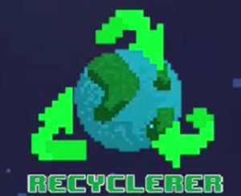

* and other kinds of software too 😁😁😁
  - but making games releases tons of ‎C8H12ClNO2
