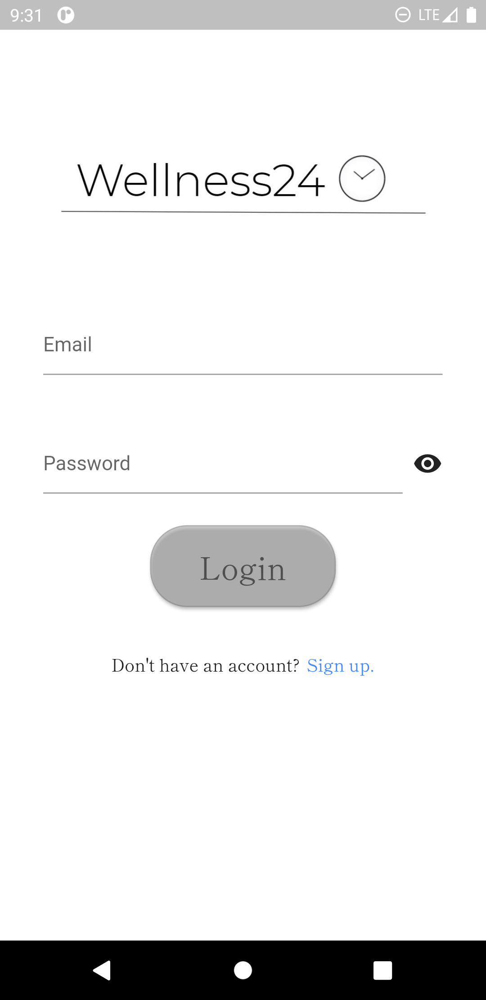

Second Year
===========

### Second Year (1/2)

- preparatory for the main events in 3rd and 4th years
  * build fullstack apps - **properly**
    

      
      

      
    

### Second Year (2/2)

- preparatory for the main events in 3rd and 4th years
  * learn to solve computationally-expensive || hard problems
  * some hardware-series courses in 2nd sem
  * learn SE tools, industry best practices, and processes that the end user
    won't typically see or appreciate
    + SE Tools and Practices
    + Software Architecture
    + Software Testing
    + Software Engineering Proceses
  * learn brilliant and battle-tested ideas 💡
    + Software Development III (functional programming)
    + Software Component Design 

#### Sample  2nd year 1st sem Project (1/6)

#### Sample 2nd year 1st sem Project (2/6)

#### Sample 2nd year 1st sem Project (3/6)

#### Sample 2nd year 1st sem Project (4/6)

#### Sample 2nd year 1st sem Project (5/6)

#### Sample 2nd year 1st sem Project (6/6)

#### Sample 2nd year 2nd sem projects (1/10)

  
  

  
  

  

#### Sample 2nd year 2nd sem projects (2/10)

  
  

  
  

  

#### Sample 2rd year 2nd sem projects (3/10)

#### Sample 2rd year 2nd sem projects (4/10)

#### Sample 2rd year 2nd sem projects (5/10)

#### Sample 2rd year 2nd sem projects (6/10)

#### Sample 2nd year 2nd sem projects (7/10)

  
  

  

#### Sample 2nd year 2nd sem projects (8/10)

  
  

  

#### Sample 2nd year 2nd sem projects (9/10)

  
  

  

#### Sample 2nd year 2nd sem projects (10/10)

  
  

  

